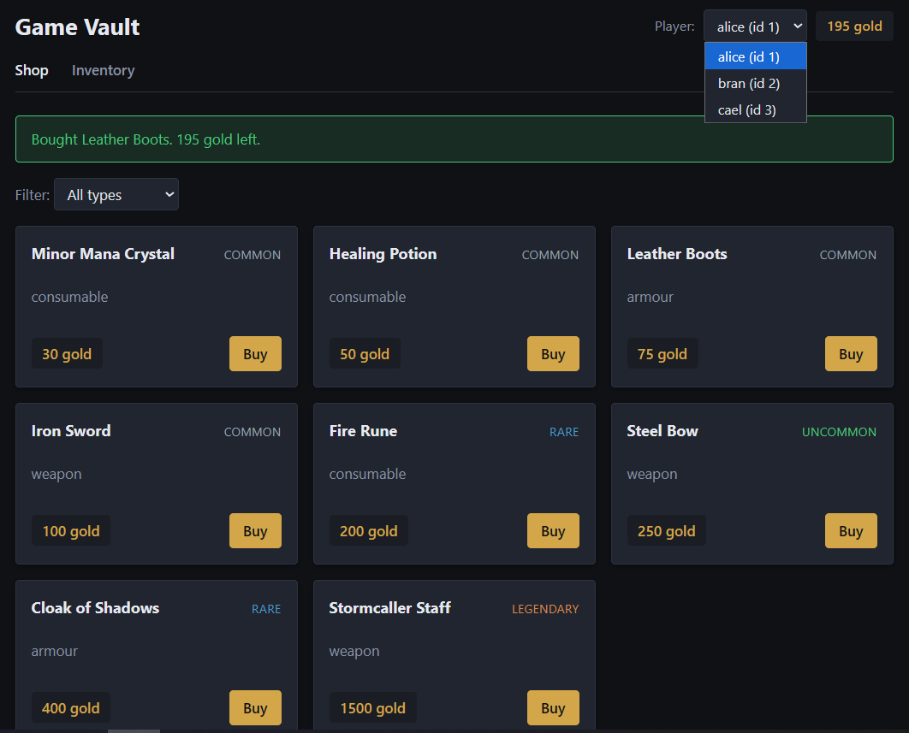
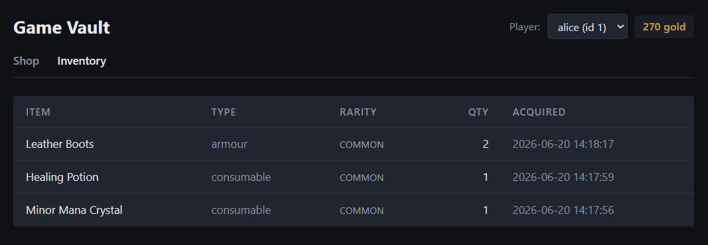

# Game Vault

This system functions as an in-game shop and inventory system developed in PHP 8 with a jQuery frontend, a REST API backend with PDO & MySQL database. Players have a gold balance, the shop lists items with prices, and clicking 'Buy' deducts gold from the player and adds the item to their inventory. This generates a fresh UUID and sends it as a key header which is stored with a SHA-256 hash of the request body and the captured response. If the same request arrives a second time (a retry after a dropped connection), the backend returns the original response and does not run the purchase again. A reused key with a different body is rejected as 409. The purchase itself runs inside a database transaction with a FOR UPDATE row lock on the player, so two concurrent purchases for the same player won't both pass the gold check and double-spend.

Most of the logic lives in two files. lib/shop.php is the purchase function: transaction, row lock, gold deduction, inventory upsert. api/purchase.php is the HTTP layer: it reads the Idempotency-Key header, checks for a replay, calls the purchase function, captures and stores the response. About 200 lines between them.

## Screenshots

Shop tab. Filter items by type, click Buy on a card to purchase. Gold balance updates in the top right.



Inventory tab. The same player's items after a few purchases.



## What's in the code

- `lib/shop.php` runs the purchase inside a transaction, locks the player row with `FOR UPDATE` to prevent a double-spend race, deducts gold, upserts the inventory row.
- `api/purchase.php` handles the Idempotency-Key header. A repeated key returns the captured response and never re-runs the purchase. A reused key with a different request body returns 409.
- `api/player.php`, `api/items.php`, `api/inventory.php` are straightforward read endpoints.
- `app.js` is the frontend. jQuery for DOM, fetch for the API calls so I can set the Idempotency-Key header on POSTs.

## Why idempotency on purchases

In a microtransaction shop the client retries on network failure. Without idempotency, a retry double-charges the player. The implementation here stores the request hash and captured response keyed by player and key. This is the part worth scrutinising.

## Setup with XAMPP

1. Drop the `game-vault` folder into `C:\xampp\htdocs\`.
2. Open the XAMPP Control Panel and start Apache and MySQL.
3. Open http://localhost/phpmyadmin/, click Import, select `schema.sql` from the project, and import it. This creates the `game_vault` database with seed data: three players and eight items.
4. `config.php` defaults to XAMPP's root user with no password. Edit it if yours differs.
5. Open http://localhost/game-vault/ in a browser.

The frontend dropdown picks between three seeded players. Click Buy on an item and the page shows the new gold balance. Switch to the Inventory tab to see what the player owns.

## Try the API directly

```
curl http://localhost/game-vault/api/player.php?id=1
curl http://localhost/game-vault/api/items.php
curl "http://localhost/game-vault/api/items.php?type=weapon"
curl "http://localhost/game-vault/api/inventory.php?player_id=1"

curl -X POST "http://localhost/game-vault/api/purchase.php?player_id=1" ^
  -H "Content-Type: application/json" ^
  -H "Idempotency-Key: test-key-001" ^
  -d "{\"item_id\":1,\"quantity\":1}"
```

Run the same POST twice with the same Idempotency-Key. The second call returns the same body with an `Idempotent-Replay: true` header and the player is charged only once.

## Run the tests

From the project root, on the command line:

```
php tests/run.php
```

Seven tests covering happy-path purchases, stacking, insufficient gold, missing player, missing item, invalid quantity, and idempotency record retrieval. Each test resets the seeded data before running, so tests are independent and re-runnable without piling up junk in the database.

## What I left out on purpose

This is a sample, not a product. For production I'd add:

- Authentication. There is none here, every request acts on the player ID in the query string.
- Rate limiting on the purchase endpoint.
- An audit log on inventory mutations.
- Config loaded from environment variables, not a PHP file inside webroot.
- Frontend in TypeScript with a build step. I went with jQuery and vanilla JS to keep the run instructions short. The patterns are the same.

## Folder layout

```
game-vault/
  config.php          DB credentials
  schema.sql          Database schema + seed data
  index.html          Frontend page
  style.css           Frontend styles
  app.js              Frontend logic
  lib/
    db.php            PDO singleton and JSON helpers
    shop.php          Purchase logic with transaction and idempotency
  api/
    player.php        GET ?id=N
    items.php         GET, optional ?type=weapon|armour|consumable
    inventory.php     GET ?player_id=N
    purchase.php      POST, requires Idempotency-Key header
  tests/
    run.php           CLI test runner
  docs/               Screenshots used by this README
```

## Licence

MIT. See [LICENSE](LICENSE).
